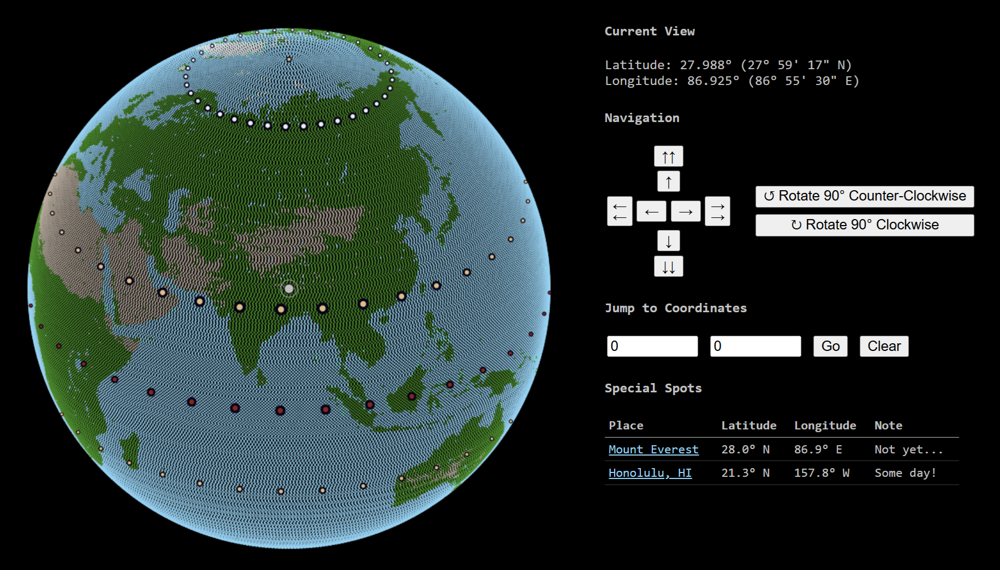

# Global

---
### ... building an online world ...

---
This project is a fun toy/craft webpage inviting users to explore 
a simple rendering of Earth's surface.

A list of noteworthy locations can be visualized: 
for example, to broadly showcase one's geographic history.



## Components

### Data Preparation (Python)
`adhoc` directory

- Generate a discrete (x,y,z) point list, with colors, to model the planet
- Running `main.py` executes 2 subroutines 
and outputs 2 .json files into the parent directory
- `input/spots.csv` is a curated list of special latitude/longitude locations 
(***easy to overwrite!***)
- `texture.png` is a reduced-palette modification of a 2020 NASA Blue Marble image resource
- Colors are configured in `constants.py`

### Interactive Visualization (HTML/JavaScript)

- `earth.html` leverages `plotter.js` and source data files in the repository root
- A navigation panel controls the globe view on the canvas, with animations following clicks
- Browsers can quickly process >150k 3-dimensional points to update the 2-dimensional image


#### Files:
```text
.
│   earth.html  # main view
│   plotter.js  # rendering and actions
│   spots.json  # highlighted places
│   xyz_points.json  # basic topography
│
└───adhoc
    │   main.py  # prepare spots.json and xyz_points.json
    │   constants.py  # color definitions and background data
    │
    └───input
            cover_sphere.py  # generate coordinates (roughly evenly spaced)
            sphere_cover.csv  # output/result of "cover_sphere.py"
            add_color.py  # associate a color with each surface-covering point
            texture.png  # flat map visual input for colors
            terrain.csv  # output/result of "add_color.py"
            spots.csv  # list of latitude/longitude sites to focus
```

#### Testing:

Place the top-level files together in a folder on a web server, then browse to `earth.html`.

On your computer, you might run `py -m http.server 8000` then open `http://localhost:8000/earth.html`.
